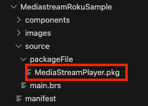
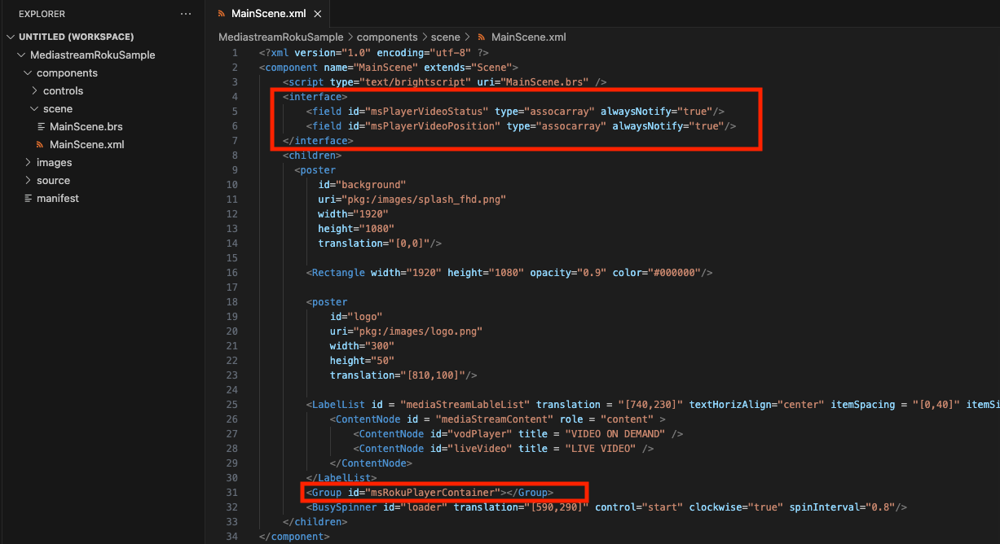

# Mediastream Platform SDK for Roku

## Overview

This library enables you to embed and manage the VOD and Live Stream player in your Roku applications.

# Usage

## Getting started

First of all we need to download the package that contains the Mediastream SDK for Roku. This can be done from the following links:

Latest version:

```
latest
```

Specified version

```
version
```

Once downloaded we need to add it to our project. To do this we need to create a folder called `source` at the base of our project and inside this folder create a new folder called `packageFile` and place MediaStreamPlayer.pkg inside it.



Then the sdk must be included to the channel. To do this we need to incorporate the following into your MainScene.xml

```xml
  <interface>
    <field id="msPlayerVideoStatus" type="assocarray" alwaysNotify="true"/>
    <field id="msPlayerVideoPosition" type="assocarray" alwaysNotify="true"/>
  </interface>
  <children>
    <Group id="msRokuPlayerContainer"></Group>
  </children>
```



Now it's time to initialize the SDK, to do it we need:
* Set `m.SDKPath` with the path of where Mediastream.pkg is located
* Create an object of type `MediastreamPlayer`
* Attach the created object to the `msRokuPlayerContainer` container
* Set the `msPlayerVideoPosition`, `SDKStatus` and `msPlayerVideoStatus` observers with functions that allow us to handle these events.

For example, we create a function initPlayer and set Observers to exemplify:

```brightscript
function initPlayer()
    print "MainScene : initPlayer"
    m.SDKPath = "pkg:/source/packageFile/MediaStreamPlayer.pkg"
    if(m.mediaStreamPlayer <> invalid)
       m.msRokuPlayerContainer.removeChild(m.mediaStreamPlayer)
       m.mediaStreamPlayer = invalid
    end if
    m.mediaStreamPlayer = CreateObject("roSGNode", "MediaStreamPlayer")
    m.mediaStreamPlayer.id = "mediaStreamPlayer"
    m.mediaStreamPlayer.callFunc("initializeSDK", m.SDKPath)
    m.msRokuPlayerContainer.appendChild(m.mediaStreamPlayer)
    m.mediaStreamPlayer.observeField("SDKStatus", "onSDKStatusChanged")
end function
```

```brightscript
sub setObservers()
    m.top.observeField("msPlayerVideoPosition", "onMsPlayerVideoPositionChanged")
    m.top.observeField("msPlayerVideoStatus", "onMsPlayerVideoStatusChanged")
end sub
```

```brightscript
function onMsPlayerVideoStatusChanged(eventData as dynamic)
    print "MainScene : onMsPlayerVideoStatusChanged " eventData.getData()
end function

function onMsPlayerVideoPositionChanged(eventData as dynamic)
    print "MainScene : onMsPlayerVideoPositionChanged " eventData.getData()
end function

function onSDKStatusChanged(event as Dynamic)
    payload = event.getData()
    print "MainScene : onSDKStatusChanged : payload : " payload
    if payload.status = "Loaded" then m.isSDKLoaded = true
end function
```

As the name implies, msPlayerVideoPosition records the current position of the current playback. While msPlayerVideoStatus records the different states of the player that can be:

* playing: Triggers whenever the video starts playing
* paused: Triggers whenever the video stops playing
* finished: Triggers whenever the video ends playing
* buffering: Triggers when player enters buffering state

On the other hand, SDKStatus will indicate events such as that the sdk is ready to be used and other informative logs or errors.

To play a content it is necessary to pass to the sdk a configuration file that could contain the following properties:

### Config Properties

| Name | Type | Required | Description |
| --- | --- | --- | --- |
| id | String | Yes | Video ID |
| account | String | Yes | Account ID |
| type | MediastreamPlayerConfig.VideoTypes | YES | Video Type. posible values: `VOD`, `LIVE`|
| environment | MediastreamPlayerConfig.Environments | No | Environment where the video is located, `PRODUCTION` or `DEV`. Default: `PRODUCTION` |
| startAt | Number | No | Skip or seek at starting, used in keep watching so this starts the video at the same point where the user left it. |

It's important to mention that Mediastream SDK contains a player so there is no need for an external player or application, don't need to make any player etc. If any player is running, it's the application’s responsibility to close that player before setting up Mediastream SDK as in roku it will allow to create only one player instance.

There are several ways to integrate the SDK according to the differents needs but in this repository you can find a example so that you can familiarize yourself with its use.